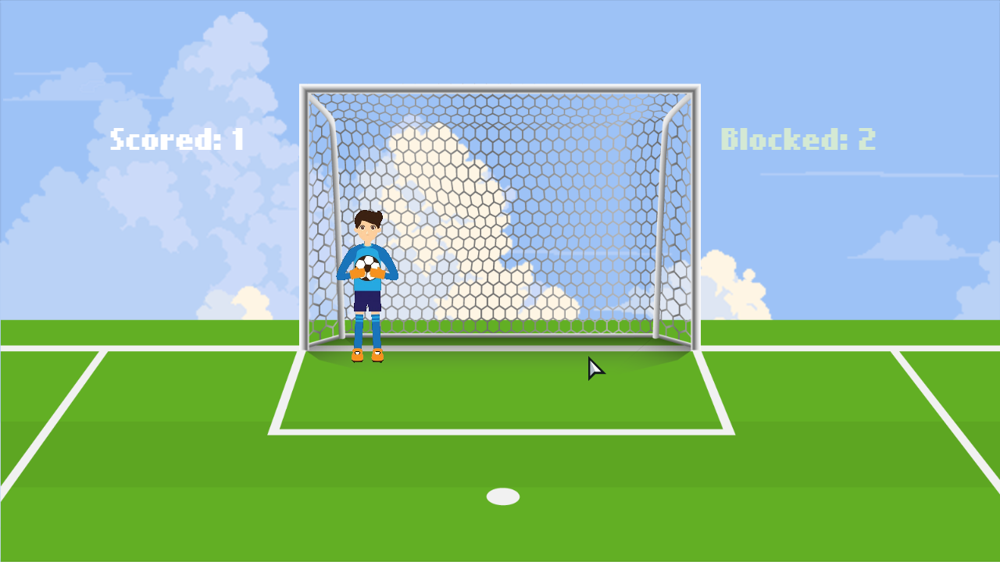
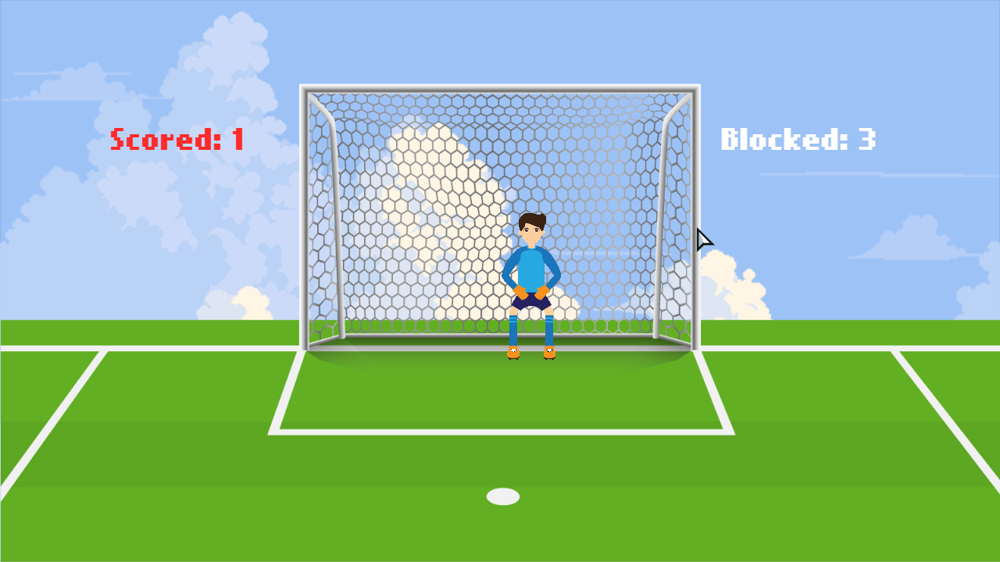
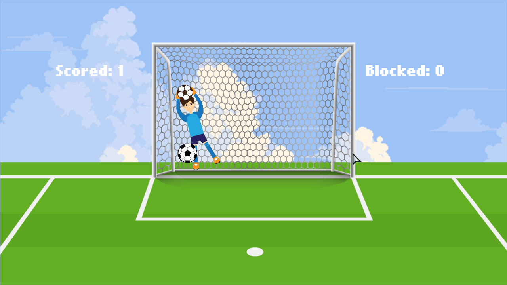
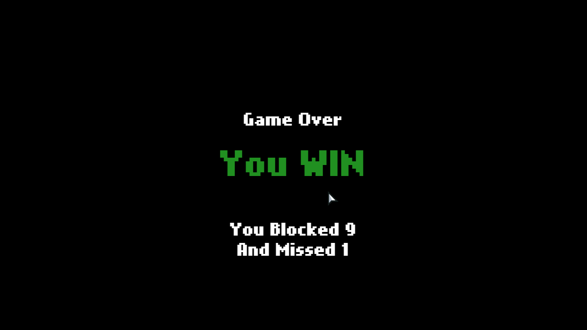
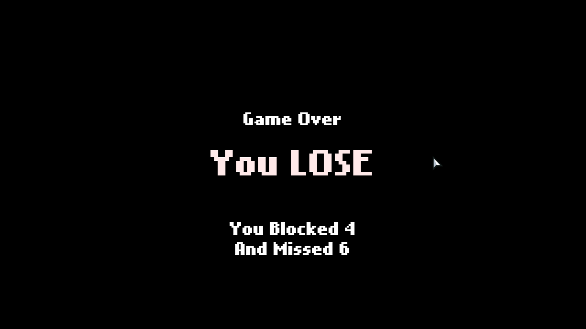

### COMP-4478
# Project-Guard

## Assignment 1

## Rules
- Balls will lauch towards the net from the bottom of the screen, at the left, right or center (at random).
- If you move the move the keeper infront of the ball before is reaches the net you will get one point and if you are or too late the game will get a point.
- The points will be highlighted (ether green or red) indicating whos point it is. Example of both are shown below.

## Controls
- Use the Arrow keys or wasd keys to move left and righ
- Press up Up, W or space to jump
- You can also  move left or right while in the air (and see the the animation below)

## Game Over
- After 10 shots are made the game is over
- If you have 5 or more blocks the you will see the win message and the score
- If did not blocks 5 or more you lose and will see the message and the score

## Code
- All the code was writen using VS Code and will be available after  submission on my GitHub at [jbledua/Project-Keeper](https://github.com/jbledua/Project-Keeper.git)